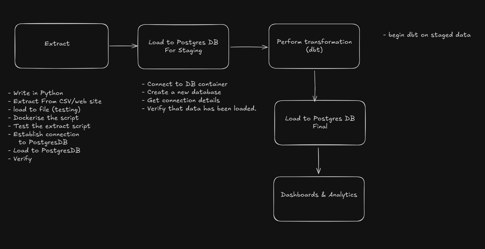

# 🏦 Dockerized Bank Data ETL Pipeline

[](https://www.docker.com/)
[](https://www.python.org/)
[](https://www.postgresql.org/)
[](https://www.getdbt.com/)

> A fully containerized ELT (Extract, Load, Transform) pipeline that extracts the world's largest banks data from Wikipedia, loads it into PostgreSQL, and transforms it with currency conversions using dbt.

## 📋 Table of Contents

- [🎯 Project Overview](#-project-overview)
- [🏗️ Architecture](#️-architecture)
- [🔧 Tech Stack](#-tech-stack)
- [🚀 Quick Start](#-quick-start)
- [📦 Services](#-services)
- [💱 Data Transformation](#-data-transformation)
- [📊 Data Flow](#-data-flow)
- [🧪 Testing](#-testing)
- [📈 Monitoring & Logging](#-monitoring--logging)
- [⚙️ Configuration](#️-configuration)
- [🔄 Scheduling](#-scheduling)
- [🐳 Docker Hub Images](#-docker-hub-images)
- [🛠️ Development](#️-development)
- [🤝 Contributing](#-contributing)
- [📄 License](#-license)

## 🎯 Project Overview

This project implements a modern ELT pipeline that:

1. **Extracts** bank data from Wikipedia's "List of largest banks" page
2. **Loads** raw data into a PostgreSQL staging database
3. **Transforms** data using dbt to perform currency conversions (USD → GBP, EUR, INR)
4. **Serves** clean, transformed data ready for analytics and dashboards

### Business Use Case
Financial analysts need up-to-date information about the world's largest banks with assets converted to multiple currencies for global market analysis.

## 🏗️ Architecture



### Data Flow
```
Wikipedia → Web Scraping → Raw Data → PostgreSQL → dbt → Transformed Data → Analytics Ready
    ↓            ↓           ↓          ↓         ↓         ↓              ↓
 HTML Table → BeautifulSoup → CSV → Staging Table → SQL → Fact Table → Dashboard
```

## 🔧 Tech Stack

| Component | Technology | Purpose |
|-----------|------------|---------|
| **Orchestration** | Docker Compose | Container orchestration and service management |
| **Extraction** | Python 3.12 | Web scraping with BeautifulSoup and requests |
| **Database** | PostgreSQL 15 | Data storage and staging |
| **Transformation** | dbt Core | SQL-based data transformations |
| **Networking** | Docker Networks | Service communication |
| **Environment** | Docker Alpine | Lightweight container images |

### Python Libraries
- `requests` - HTTP requests for web scraping
- `beautifulsoup4` - HTML parsing and data extraction
- `pandas` - Data manipulation and CSV handling
- `sqlalchemy` - Database connectivity and ORM
- `psycopg2` - PostgreSQL adapter
- `python-dotenv` - Environment variable management

## 🚀 Quick Start

### Prerequisites
- Docker Engine 20.10+
- Docker Compose 2.0+
- Git
- 8GB+ RAM recommended

### 1. Clone Repository
```bash
git clone https://github.com/Celnet-hub/Dockerized-Bank-Date-etl-pipeline.git
cd Dockerized-Bank-Date-etl-pipeline
```

### 2. Environment Setup
Create `.env` file with your database credentials:
```bash
cp .env.example .env
# Edit .env with your database settings
```

**Example .env:**
```env
DB_USER=admin
DB_PASSWORD=<your-password>
DB_HOST=etl-postgres-db
DB_PORT=5432
DB_NAME=scraped_data_db
```

### 3. Network Setup
```bash
# Create external network
docker network create etl-network

# Connect your existing PostgreSQL to the network (if external)
docker network connect etl-network your-postgres-container
```

### 4. Run Pipeline
```bash
# Build and run all services
docker-compose up --build

# Run in detached mode
docker-compose up -d --build
```

### 5. Verify Results
```bash
# Check transformed data
docker exec etl-postgres-db psql -U admin -d scraped_data_db -c "
SELECT rank, bank_name, assets_usd_billions, assets_gbp_billions 
FROM public.fact_banks_multi_currency 
ORDER BY rank LIMIT 10;"
```

## 📦 Services

### 🐍 ETL Service (`etl-service`)
**Purpose:** Web scraping and data loading
- **Image:** Custom Python 3.12 Alpine
- **Source:** `./ELT/`
- **Function:** Extracts bank data from Wikipedia and loads to PostgreSQL
- **Runtime:** ~2-3 minutes
- **Output:** `largest_banks_2025` table

**Key Features:**
- Rate limiting (10-second delay)
- Error handling for network requests
- Data quality validation
- Automatic table replacement

### 🗄️ PostgreSQL Database (`postgres`)
**Purpose:** Data storage and staging
- **Image:** `postgres:15-alpine`
- **Network:** `etl-network`
- **Persistence:** Named volume `postgres_data`
- **Access:** Port 5432

**Tables:**
- `largest_banks_2025` - Raw scraped data
- `exchange_rates` - Currency conversion rates
- `fact_banks_multi_currency` - Final transformed data

### 🔄 dbt Service (`dbt`)
**Purpose:** Data transformation and modeling
- **Image:** Custom dbt with PostgreSQL adapter
- **Source:** `./dbt_integration/`
- **Models:** Staging and mart layers
- **Function:** Currency conversions and data quality

**Models:**
- `stg_largest_banks` - Data cleaning and standardization
- `fact_banks_multi_currency` - Multi-currency fact table

## 💱 Data Transformation

### Staging Layer (`stg_largest_banks`)
```sql
-- Cleans and standardizes raw data
SELECT 
    "Banks" as bank_name,
    CAST(REGEXP_REPLACE("Assets_Billions_USD_2025", '[^0-9.]', '', 'g') AS DECIMAL(10,2)) as assets_usd_billions,
    CURRENT_TIMESTAMP as loaded_at
FROM {{ source('public', 'largest_banks_2025') }}
WHERE "Banks" IS NOT NULL AND "Assets_Billions_USD_2025" IS NOT NULL
```

### Transformation Layer (`fact_banks_multi_currency`)
```sql
-- Converts USD to multiple currencies
SELECT 
    ROW_NUMBER() OVER (ORDER BY assets_usd_billions DESC) as rank,
    bank_name,
    assets_usd_billions,
    ROUND(CAST(assets_usd_billions * 0.82 AS NUMERIC), 2) as assets_gbp_billions,
    ROUND(CAST(assets_usd_billions * 0.92 AS NUMERIC), 2) as assets_eur_billions,
    ROUND(CAST(assets_usd_billions * 83.50 AS NUMERIC), 2) as assets_inr_billions,
    loaded_at,
    CURRENT_TIMESTAMP as transformed_at
FROM staging_data
```

### Currency Exchange Rates
| Currency | Rate to USD | Last Updated |
|----------|-------------|--------------|
| GBP | 0.82 | 2025-10-07 |
| EUR | 0.92 | 2025-10-07 |
| INR | 83.50 | 2025-10-07 |

## 📊 Data Flow

### Extract Phase
1. **HTTP Request** to Wikipedia with rate limiting
2. **HTML Parsing** using BeautifulSoup
3. **Data Extraction** from table rows
4. **Basic Validation** for completeness

### Load Phase
1. **Database Connection** via SQLAlchemy
2. **Table Creation/Replacement** in PostgreSQL
3. **Bulk Insert** using pandas.to_sql()
4. **Transaction Management** with error handling

### Transform Phase
1. **Data Cleaning** - Remove special characters, standardize formats
2. **Currency Conversion** - Apply exchange rates to USD values
3. **Business Logic** - Add rankings and audit timestamps
4. **Quality Assurance** - dbt tests for data integrity

## 🧪 Testing

### dbt Tests
```bash
# Run all tests
docker-compose run --rm dbt test

# Run specific test
docker-compose run --rm dbt test --select stg_largest_banks
```

### Data Quality Checks
- **Not Null:** Essential fields validation
- **Unique:** Primary key constraints
- **Referential:** Cross-table relationships
- **Business Rules:** Positive asset values

### Manual Verification
```bash
# Check record count
docker exec etl-postgres-db psql -U admin -d scraped_data_db -c "
SELECT COUNT(*) FROM public.fact_banks_multi_currency;"

# Validate currency conversions
docker exec etl-postgres-db psql -U admin -d scraped_data_db -c "
SELECT bank_name, assets_usd_billions, assets_gbp_billions,
       ROUND(assets_usd_billions * 0.82, 2) as expected_gbp
FROM public.fact_banks_multi_currency LIMIT 5;"
```

## 📈 Monitoring & Logging

### Application Logs
```bash
# View ETL logs
docker-compose logs etl-service

# View dbt logs
docker-compose logs dbt

# Follow logs in real-time
docker-compose logs -f
```

### Database Monitoring
```bash
# Check connection status
docker-compose run --rm dbt debug

# Monitor database performance
docker exec etl-postgres-db psql -U admin -d scraped_data_db -c "
SELECT schemaname, tablename, n_tup_ins, n_tup_upd, n_tup_del 
FROM pg_stat_user_tables;"
```

### Health Checks
```bash
# Service status
docker-compose ps

# Network connectivity
docker network inspect etl-network
```

## ⚙️ Configuration

### Environment Variables
| Variable | Description | Default | Required |
|----------|-------------|---------|----------|
| `DB_USER` | PostgreSQL username | - | ✅ |
| `DB_PASSWORD` | PostgreSQL password | - | ✅ |
| `DB_HOST` | Database host | etl-postgres-db (containerised postgres service) | ✅ |
| `DB_PORT` | Database port | 5432 | ✅ |
| `DB_NAME` | Database name | - | ✅ |

### dbt Configuration
**profiles.yml:**
```yaml
dbt_integration:
  target: dev
  outputs:
    dev:
      type: postgres
      host: "{{ env_var('DB_HOST') }}"
      user: "{{ env_var('DB_USER') }}"
      password: "{{ env_var('DB_PASSWORD') }}"
      port: "{{ env_var('DB_PORT') | int }}"
      dbname: "{{ env_var('DB_NAME') }}"
      schema: public
```

## 🔄 Scheduling

### Cron Job Setup
```bash
# Add to crontab for daily runs at midnight
0 0 * * * cd /path/to/project && docker-compose up --build
```

### Production Scheduling Options
- **Airflow:** Full workflow orchestration
- **GitHub Actions:** CI/CD pipeline integration

## 🐳 Docker Hub Images

### Published Images
- `celnet1/etl-app-image:version1` - [Python Script image](https://hub.docker.com/r/celnet1/etl-app-image)
- `celnet1/etl-postgres:version1` - [PostgresDB image](https://hub.docker.com/r/celnet1/etl-postgres)
- `celnet1/etl-dbt:version1` - [dbt transformation container](https://hub.docker.com/r/celnet1/etl-dbt)

### Build and Push
```bash
# Build images
docker-compose build

# Tag for Docker Hub
docker tag dockerised_etl-etl-service your-username/etl-service:latest
docker tag dockerised_etl-dbt your-username/dbt-transform:latest

# Push to registry
docker push your-username/etl-service:latest
docker push your-username/dbt-transform:latest
```

## 🛠️ Development

### Project Structure
```
├── docker-compose.yaml      # Service orchestration
├── .env                     # Environment variables
├── ELT/                     # Python ETL service
│   ├── Dockerfile          # ETL container definition
│   ├── get_data.py         # Main extraction script
│   └── requirements.txt    # Python dependencies
├── dbt_integration/        # dbt transformation project
│   ├── Dockerfile         # dbt container definition
│   ├── dbt_project.yml    # dbt configuration
│   ├── models/            # SQL transformation models
│   │   ├── staging/       # Data cleaning layer
│   │   └── marts/         # Business logic layer
│   └── seeds/             # Reference data (exchange rates)
└── README.md              # This file
```

### Development Workflow
1. **Feature Development:** Create feature branch
2. **Local Testing:** Run `docker-compose up --build`
3. **Data Quality:** Execute `docker-compose run --rm dbt test`
4. **Code Review:** Submit pull request
5. **Deployment:** Merge to main branch

### Adding New Currency
1. Update `seeds/exchange_rates.csv`
2. Modify `fact_banks_multi_currency.sql`
3. Add corresponding tests in `schema.yml`
4. Run `docker-compose run --rm dbt seed` and `dbt run`


## 🎯 Results

### Sample Output
| Rank | Bank Name | USD (Billions) | GBP (Billions) | EUR (Billions) | INR (Billions) |
|------|-----------|----------------|----------------|----------------|----------------|
| 1 | Industrial and Commercial Bank of China | $6,688.74 | £5,484.77 | €6,153.64 | ₹558,509.79 |
| 2 | Agricultural Bank of China | $5,923.76 | £4,857.48 | €5,449.86 | ₹494,633.96 |
| 3 | China Construction Bank | $5,558.38 | £4,557.87 | €5,113.71 | ₹464,124.73 |

### Performance Metrics
- **Extraction Time:** ~30 seconds
- **Load Time:** ~5 seconds
- **Transformation Time:** ~10 seconds
- **Total Pipeline Runtime:** ~45 seconds
- **Data Volume:** 100+ banks processed

---

**Built with ❤️ for the CDE Bootcamp | [GitHub](https://github.com/Celnet-hub)**
